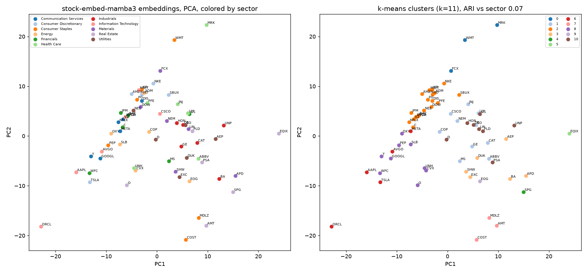

# Examples

Free Yahoo data to a clustering plot and a sector classifier, on a fixed universe of 66
large US stocks, six per GICS sector (`universe.csv`). Everything below ran on
2026-09-14 against bars from 2026-08-17 to 2026-09-14; your numbers will differ because Yahoo
only serves the last 30 days of 1-minute bars.

| Script | What it does | Needs |
|---|---|---|
| `fetch_yfinance.py` | downloads 1-minute bars and corporate actions for the universe into `out/` | network |
| `embed_universe.py` | bars to adjusted bars to features to one 256-dim embedding per ticker, plus an 18-number summary-statistics baseline | CUDA GPU, mamba_ssm, the checkpoint |
| `cluster_plot.py` | PCA scatter colored by sector next to k-means clusters, saved as `out/clusters.png` | matplotlib, scikit-learn |
| `sector_knn.py` | leave-one-out k-NN sector accuracy for embeddings, baseline and chance | numpy |

## Run

With the Docker image from the repo root (the `examples` extra is installed in it):

```bash
docker build -f docker/Dockerfile -t stock-embed-mamba3 .
mkdir -p examples/out
run() { docker run --rm --gpus all -v "$PWD/examples/out":/workspace/examples/out -e HF_TOKEN stock-embed-mamba3 "$@"; }
run python examples/fetch_yfinance.py     # about 4 requests per ticker and 5 minutes in all; re-running skips tickers on disk
run python examples/embed_universe.py     # downloads the checkpoint on first use
run python examples/cluster_plot.py
run python examples/sector_knn.py
```

Everything the scripts write (bars, actions, `embeddings.npz`, `clusters.png`) lands in
`examples/out` on the host through that bind mount. `-e HF_TOKEN` forwards a token exported
in your shell; it is needed only while the Hugging Face repo is private. The checkpoint is
downloaded again on each `embed_universe.py` run unless you also mount your Hugging Face
cache or set `STOCK_MAMBA3_DIR` to a local copy.

On Windows, run these from WSL or PowerShell, or prefix each `docker` command in Git Bash
with `MSYS_NO_PATHCONV=1`; without it Git Bash rewrites the `/workspace/...` mount target,
the scripts write into the container instead of `examples/out`, and nothing appears on the
host. In PowerShell pass the token as `-e HF_TOKEN=$env:HF_TOKEN`.

Outside Docker, `pip install -e ".[model,examples]"` plus a working `mamba_ssm` build is
enough. Only `embed_universe.py` needs the GPU.

## What came out

Leave-one-out k-NN sector accuracy, 66 tickers, 11 sectors:

| k | embeddings | summary-statistics baseline | chance |
|---|---|---|---|
| 1 | 22.7% | 31.8% | 7.9% |
| 3 | 25.8% | 31.8% | 7.7% |
| 5 | 24.2% | 31.8% | 7.3% |

k-means with k=11 against the sectors: adjusted Rand index 0.066 for the embeddings
and 0.049 for the baseline, both close to zero, so neither clustering recovers the sectors.



The committed `clusters.png` is a snapshot of the 2026-09-14 run; each run rewrites
`out/clusters.png`.

## How to read this

- Both representations beat chance by two to four times, so ten sessions of minute bars
  do carry sector information. The embedding is not the better carrier: per-ticker means
  and standard deviations of the same nine channels classify sectors better at every k.
  Do not expect this checkpoint to be a sector detector.
- This matches the authors' finding, documented in the model card, that the embedding is
  mostly a stable per-stock identity. Identity is finer than sector, so the nearest
  neighbour of a stock is often a stock that trades like it, not one in its industry.
- The warm-up matters. Embedding all 20 sessions with no lead-in, so the volume channel
  starts cold, dropped the embedding's 1-NN accuracy to about 15%, while the baseline, given the
  extra ten sessions, rose to between 34% and 38%. Feed the model a lead-in as the contract says.
- Nothing here is a trading signal. The model card documents that the embedding carried no
  cross-sectional return signal in the authors' evaluation.

## Caveats on the free data

- Yahoo serves 1-minute bars for the last 30 calendar days only, 8 days per request. That
  is about 20 sessions per ticker. `embed_universe.py` spends the first 10 warming the
  volume channel's rolling mean and embeds the last 10. Training computed the rolling mean over each
  security's full history and used windows of up to 10,000 bars, so these embeddings come from shorter, less warmed
  windows than the model saw.
- Yahoo reports no volume for pre-market and post-market bars. The model would read those
  as its zero-volume sentinel on more than half of all bars, a large shift from the
  training feed, so `fetch_yfinance.py` takes the regular session only. Include extended
  hours only from a vendor feed that reports real volume for them. `--prepost` pulls them
  from Yahoo too, which is not recommended for the reason above.
- `Ticker.info` is unreliable from some networks, so the sector labels are a static table
  in `universe.csv`, not fetched.
- Yahoo prices and volumes are split-adjusted even with `auto_adjust=False`, so
  `embed_universe.py` applies Yahoo's dividends only. Passing Yahoo's splits as well
  would adjust a split inside the window twice.

## Other things worth trying

- Nearest neighbours of one ticker over time: embed successive 10-session windows and see
  how stable the neighbour list is. The model card reports day-over-day autocorrelation
  of 0.83 for the window embedding.
- Regime split: embed the same tickers in a calm and a volatile month from a vendor feed
  and compare the two clouds.
- Inpainting error as an anomaly score: mask each patch in turn and rank bars by
  reconstruction error. The model card's "What the model does not have" section applies.
